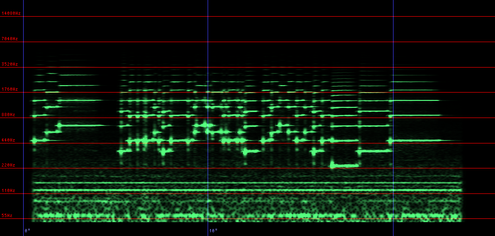

# wavspa

"wavspa" is a WAV file spectrum analyzer. Includes FFT and wavelet analyzers. 

## Installation

Add this line to your application's Gemfile:

```ruby
gem 'wavspa'
```

And then execute:

    $ bundle

Or install it yourself as:

    $ gem install wavspa

This application uses OpenMP, but by default tries to link the libgomp. When using another implementation (such as intel OpenMP) with macOS etc, specify the libary path and library name by command line options as follows:

    $ gem insatll wavspa -- --with-openmp ~/env/opts/lib --omp-name omp

## Usage

### FFT analyzer

```
wavfft [options] WAV-FILE

options:
    -o, --output=FILE
    -p, --preset=NAME
    -f, --fft-size=SIZE
    -u, --unit-time=CS
    -W, --output-width=SIZE
    -w, --window-function=FUNCTION
    -r, --frequency-range=LO,HI,
    -m, --scale-mode=MODE
        --show-params
    -c, --col-steps=SIZE
    -F, --draw-freq-line
    -T, --draw-time-line
    -v, --verbose
    -h, --help
```

#### options

<dl>
  <dt>-o, --output</dt>
  <dd>specify the output file name. by default, output to the file that extension of input file changed to ".png".</dd>

  <dt>-p, --preset=NAME</dt>
  <dd>specify preset settings. you can specify one of "default", "32k" or "cd".</dd>

  <dt>-f, --fft-size=FFT</dt>
  <dd>specify the FFT size (by number of samples, this value must spcify a power of 2).</dd>

  <dt>-u, --unit-time=CS</dt>
  <dd>specify the unit time of short time FFT in centiseconds (1/100 sec). This value is the time per pixel in horizontal direction of the output PNG.</dt>

  <dt>-W, --output-width=SIZE</dt>
  <dd>specify the hight of output PNG (by number of pixels).</dd>

  <dt>-r, --frequency-range=LO,HI</dt>
  <dd>specify the frequency band show on the output PNG (upper limit to "HI", and lower limit to "LO").<dd>

  <dt>-m, --scale=mode</dt>
  <dd>specify the mode of grid scale in vertical direction of th output PNG. you can specify one of "LOGSCALE" or "LINEARSCALE" (default is "LOGSCALE").</dd>

  <dt>-c, --col-steps=SIZE</dt>
  <dd>specify the horizontal magnify ratio of th output file.</dd>

  <dt>--show-params</dt>
  <dd>show sumarry of settings.</dd>

  <dt>-F, --draw-freq-line</dt>
  <dd>enable frequency line (vertical grid).</dd>

  <dt>-F, --draw-freq-line</dt>
  <dd>enable time line (horizontal grid).</dd>

   <dt>-v, --verbose</dt>
   <dd>enable verbose mode</dd>

   <dt>-h, --help</dt>
   <dd>show help message</dd>
</dl>

### Wavelet analyzer

```
wavlet [options] WAV-FILE

options:
    -o, --output=FILE
    -p, --preset=NAME
    -s, --sigma=NUMBER
    -a, --amplitude-mode
    -u, --unit-time=CENTISECOND
    -W, --output-width=SIZE
    -r, --frequency-range=LO,HI
        --floor-gain=DB
        --ceil-gain=DB
    -m, --scale-mode=STRING
    -c, --col-steps=SIZE
        --show-params
    -F, --draw-freq-line
    -T, --draw-time-line
    -v, --verbose
```

<dl>
  <dt>-o, --output</dt>
  <dd>specify the output file name. by default, output to the file that extension of input file changed to ".png".</dd>

  <dt>-p, --preset=NAME</dt>
  <dd>specify preset settings. you can specify one of "default" or "cd".</dd>

  <dt>-s, --sigma=FLOAT</dt>
  <dd>specify the sigma value. Increasing this value improves the accuracy but increases the processing load.</dd>

  <dt>-a, --amplitude-mode</dt>
  <dd>When this option is specified, the amplitude spectrum is output (otherwise, the power spectrum is output).</dd>

  <dt>-u, --unit-time=CS</dt>
  <dd>specify the unit time of wavelet stransform in centiseconds (1/100 sec). This value is the time per pixel in horizontal direction of the output PNG.</dt>

  <dt>-W, --output-width=SIZE</dt>
  <dd>specify the hight of output PNG (by number of pixels).</dd>

  <dt>-r, --frequency-range=LO,HI</dt>
  <dd>specify the frequency band show on the output PNG (upper limit to "HI", and lower limit to "LO").<dd>

  <dt>--floor-gain=DB</dt>
  <dd>specify the upper limit value of the gain to be displayed. values exceeding this number are displayed as saturated.</dd>

  <dt>--ceil-gain=DB</dt>
  <dd>specify the lower limit value of the gain to be displayed. values less than this number will be masked.</dd>

  <dt>-m, --scale=mode</dt>
  <dd>specify the mode of grid scale in vertical direction of th output PNG. you can specify one of "LOGSCALE" or "LINEARSCALE" (default is "LOGSCALE").</dd>

  <dt>-c, --col-steps=SIZE</dt>
  <dd>specify the horizontal magnify ratio of th output file.</dd>

  <dt>--show-params</dt>
  <dd>show sumarry of settings.</dd>

  <dt>-F, --draw-freq-line</dt>
  <dd>enable frequency line (vertical grid).</dd>

  <dt>-F, --draw-freq-line</dt>
  <dd>enable time line (horizontal grid).</dd>

   <dt>-v, --verbose</dt>
   <dd>enable verbose mode</dd>

   <dt>-h, --help</dt>
   <dd>show help message</dd>
</dl>

## Output example
As a sample data, transformed from "Call to Quarters" (https://archive.org/details/CallToQuarters).

### FFT
```
 wavfft -p cd -F -T -v -o Call_To_Quarters-fft.png Call_To_Quarters.wav
```




### Wavelet
```
 wavlet -p cd -F -T -c 2 -v -o Call_To_Quarters-wavelet.png Call_To_Quarters.wav
```


## Contributing

Bug reports and pull requests are welcome on GitHub at https://github.com/kwgt/wavspa.

## その他
以下のソースコード及びデータを流用しています。各々の開発者の方に感謝いたします。

* wavfftで使用しているFFT処理は大浦氏が配布されているコード(通称「大浦FFT」 http://www.kurims.kyoto-u.ac.jp/~ooura/fft.html) を流用しています(ext/wavspa/fft/fftsg.c)。
* プロット時に使用しているフォントはM+ BITMAP (http://mplus-fonts.osdn.jp/mplus-bitmap-fonts/) で配布されているm+ gothic 10rを変換し使用しています(ext/wavspa/fb/rb_fb.c)。

## License

The gem is available as open source under the terms of the [MIT License](https://opensource.org/licenses/MIT).
